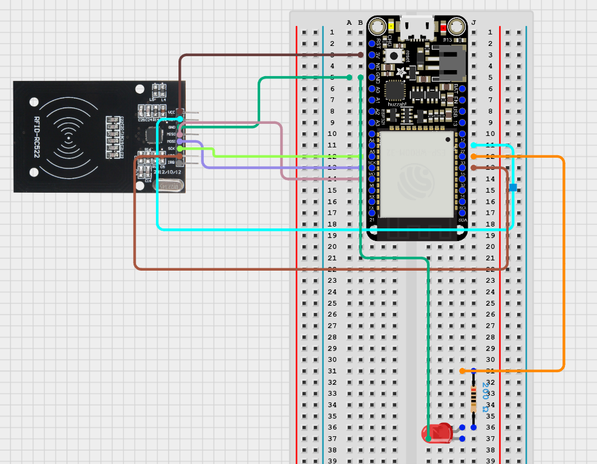

# Matériel

Vous aurez besoin de :

-1 ESP32

-1 lecteur RFID-RC522

-1 Led

-1 résistance

-quelques fils

# Branchements

Voici un schéma de l'ESP32 qui devrait vous aider pour les branchements :

-Branchez le lecteur RFID comme suit:
SCK-->GPIO5, MOSI-->GPIO18, MISO-->GPIO19, RST-->GPIO12, NSS-->GPIO33.

-Branchez une Led sur le GPIO27 (branchez une résistance en série)

Cela devrait vous donner à peu près le branchement suivant :

N'hésitez pas à brancher le lecteur RFC au breadboard pour raccorder ensuite à l'ESP32!

Branchez enfin l'écran oled à l'ESP32 (il est fait pour se brancher directement sur l'ESP, "par dessus")

# Utilisation

L'ESP 32 doit être connecté à internet pour que tout fonctionne (le programme se mettra automatiquement en erreur sinon). Vous devez donc modifier les variables SSID et password qui se trouvent en haut du fichier main. Vous devez également modifier la variable ip_request et la remplir avec

# Problème technique avec la serrure

Le blocage technique repose sur une incompatibilité majeure entre les composants disponibles et la physique du circuit. Premièrement, le transistor que nous possédons (PH2907A) est de type PNP et conçu pour de faibles courants (max 600mA).Il risque donc de fondre sous la demande de la serrure (souvent >1A). De plus, le fait qu'il soit PNP rend son pilotage impossible ici : alimenté en 12V, il nécessiterait un signal de 12V pour s'éteindre, or l'ESP32 ne délivre que 3.3V, ce qui laisserait la serrure activée (donc ouverte) en permanence. Deuxièmement, l'absence de diode de roue libre (type 1N4007) est critique : une LED ou une simple résistance ne peuvent pas absorber la violente décharge électrique inverse (surtension) créée par la bobine de la serrure à l'extinction, et cela risquerait d'endommager fortement l'ESP32.

Voici un schéma du montage théorique :

